# 开发前

## 定义

在开发前，我认知中的端侧深度学习推理框架的定义：

1. 推理框架和训练框架的区别在于是否有反向传播，如果不进行梯度更新，那么就是推理框架
2. 端侧主要是指移动端设备，与桌面端的区别在于计算条件限制多，例如算力小，内存少，功耗低

## 基本能力

那么一个端侧深度学习推理框架应该具备的最基本的能力应该是：

1. convertor部分，既然不自己训练模型，那么就需要将其他训练框架训练得到的模型（pytorch，tensorflow），或者业界通用的一些模型（onnx）转换为自己可以处理的格式（本框架的IR，intermediate representation），这就是一个框架的第一个功能：convertor。这个接口一般是python，需要用到pytorch，tensorflow，onnx的py库，解析模型，转换模型，并保存为自己的文件格式。
2. 核心的IR部分，需要涉及类与结构体，能够表示神经网络的图结构（op、tensor，以及拓扑关系）。这时候得到的模型是一个文件，需要解析成为C++的IR，使用C++语言表示的模型（图），这个功能一般叫做模型解析器（model parser），这一步就是使用C++将文件变为待计算的图表示。
3. runtime部分，这是框架的承上启下的部分，运用多后端的算力，整体调度计算资源，安排一次运行。
4. kernel部分，决定跑在什么后端，每个op都会对应具体的kernel，描述这个算子具体的计算行为。

以上，理论上就可以将一个onnx conv2d单算子网络跑出一个结果。

## 拓展能力

进一步思考，一个框架逐渐发现，还应该具备的能力有：

1. 图优化——框架的核心竞争力。原始的网络节点可能算起来比较慢，框架一般会对网络进行通用（后端无关的）优化，例如算子融合、算子拆分等，保证交给后端硬件的计算是能发挥最大性能的软件代码。
2. 下游生态对接，框架虽然有自己直接操作硬件后端（cpu，gpu，npu等）的能力，但是某些情况下kernel可能并没有SoC的厂商实现更好，或者有一定限制，必须使用另一个更底层的框架来承接计算任务，这时候可以采用delegate的方式（类似于tflite的方式）。
3. 上游生态对接，框架可能会提供被其他框架使用的能力，这时候就不需要显式的序列化模型了，可以直接进行IR的mapping，也就是图级别的接入，也可以采取delegate的方式（如果上层框架提供了这种能力）
4. 量化，这也是框架重要的能力之一。因为端侧设备的内存限制和算力限制，以及低时延高速度的要求，float32（fp32）的模型往往不能满足要求，基本都会走一下量化的步骤，得到int8的模型。再加上目前大模型的出现，int4的量化重要性逐渐增加。
5. 异构。如何发挥各个后端的性能，统一调配计算资源，发挥SoC的最大性能。
6. 几个难点：动态形状，控制流算子等




# 开发中

> 本项目作者受tensorflow lite，paddle-lite，Android NNAPI影响较大，一些设计可能借鉴上述项目
>
> 本项目实践过程跟随项目：https://github.com/zjhellofss/KuiperInfer，在此表示感谢

## 构建

### Windows

#### cmake

1. power shell

> 使用mingw：gcc+ld

```ps1
.\build.ps1
```

如需修改生成器：

- ninja（默认）

```ps1
# choose one of follows, depend on you
cmake ..
cmake .. -G Ninja

# choose one of follows, depend on you
cmake --build .
ninja
```

- make

```ps1
# choose one of follows, depend on you
cmake .. -G "MinGW Makefiles"
cmake .. -G "Unix Makefiles"

# choose one of follows, depend on you
cmake --build .
make
mingw32-make
```

2. VS power shell中

> 使用msvc：cl+link

```ps1
.\build.ps1
```

如需修改生成器：

- ninja（默认）
  - 同上
- make
  - 同上
  - MinGW
  - Unix
  - 注意：使用"Unix Makefiles"生成器时，编译器使用gcc
- nmake（msvc特有）

```ps1
cmake .. -G "NMake Makefiles"

# choose one of follows, depend on you
cmake --build .
nmake
```

总的来说就是多了一个nmake，剩下和mingw是一样的。不推荐msvc的编译器，经常有一些奇怪的错误

3. msys2 ucrt shell

> 使用mingw：gcc+ld

```sh
./build.sh
```

如需修改生成器：

- ninja（默认）
  - 同上
- make
  - 同上，增加以下：

```sh
cmake .. -G "MSYS Makefiles"

# choose one of follows, depend on you
cmake --build .
make
```

只是多了"MSYS Makefiles"生成器，其他都一样，更接近Linux

#### bazel

1. power shell

> 默认使用msvc工具链

```ps1
.\bazel.ps1
```

### Linux

#### cmake

1. Ubuntu 20.04

> 使用gnu：gcc+ld

```sh
./build.sh
```

如需修改生成器：

- make（默认）

```sh
# choose one of follows, depend on you
cmake ..
cmake .. -G "Unix Makefiles"

# choose one of follows, depend on you
cmake --build .
make
```

- ninja

```sh
cmake .. -G Ninja

# choose one of follows, depend on you
cmake --build .
ninja
```

Linux只支持"Unix Makefiles"和"Ninja"，没有那么多花里胡哨的

#### bazel

1. Ubuntu 20.04

> 默认使用gcc工具链

```sh
./bazel.sh
```